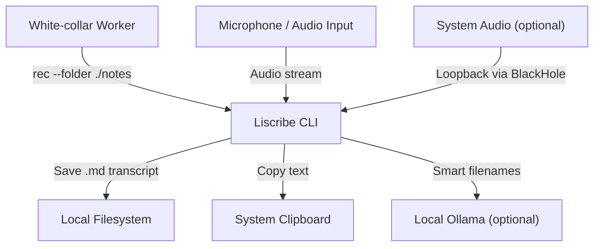
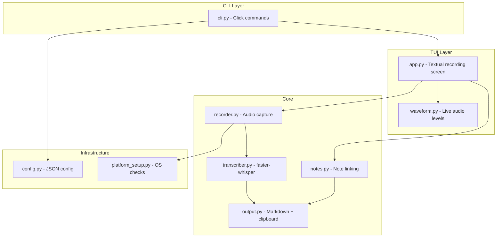

# Liscribe Implementation Plan

## Priority: Recording First, Iron-Clad

1. **Recording foundation first** — Mic listing, selection, **change mic mid-recording**, save audio to the given path. Support both **no BlackHole** (mic only) and **with BlackHole** (mic + speaker via multi-output). This base must be reliable and clean before any transcription.
2. **Then transcription** — Transcribe saved audio, write transcript to Markdown in the same folder. **Remove audio files only after** the transcript is written and saved to the MD file.
3. **Venv** — Project lives in a venv; when you run `rec`, that process runs in the venv until recording (and any post-processing) stops, then the process exits. Provide a launcher so "run rec" effectively activates the venv for the duration of the run.

## CLI (Target)

```bash
rec -f /path/to/save              # Mic only; save audio (and later transcripts) under this folder
rec --folder /path/to/save        # Same
rec -f /path/to/save -s           # Also record speaker: switch system output to user-created multi-output (includes BlackHole), then record mic + BlackHole
rec --folder /path/to/save --speaker
```

- `-f` / `--folder`: path to save recordings (and transcripts). Required for `rec`.
- `-s` / `--speaker`: record system audio as well as mic; on macOS this switches the system output device to a multi-output device that includes BlackHole so both mic and loopback are captured.

## Scope: macOS First

- **First version targets macOS only.** PortAudio (e.g. `brew install portaudio`), BlackHole, Multi-Output Device, and `switchaudio-osx` are the assumed environment. All implementation and testing in Phases 1–7 are for macOS.
- **Linux and Windows** are out of scope for the first release; document intent and add platform detection so we can extend later without reworking the core.

## Key Architecture Decisions

- **Language:** Python 3.10+ (all listed deps are Python; ratatui reference is UI inspiration only)
- **Packaging:** `pyproject.toml` with `[project.scripts]` entry point so users run `rec` directly after `pip install`
- **CLI framework:** `click` -- mature, minimal, produces clean `--help` output
- **TUI (recording session):** `textual` (built on `rich`) -- handles concurrent live display + keyboard input natively, which is essential for the waveform + note-taking workflow
- **Audio:** `sounddevice` for capture, `scipy` for WAV I/O, `numpy` for buffer processing
- **Transcription:** `faster-whisper` with CTranslate2 backend (offline after initial model download)
- **Config:** JSON file with per-option descriptions, stored at `~/.config/liscribe/config.json`
- **Output:** Markdown files with YAML front matter (via `PyYAML`)
- **Venv:** Project uses a single venv; run `rec` from inside it (or via a launcher that activates venv then runs `rec`). Process runs until recording and post-processing stop, then exits — so the "venv session" is the lifetime of the `rec` run.

## Project Structure

```
liscribe/
├── pyproject.toml
├── README.md
├── .gitignore
├── config.example.json
├── docs/
│   └── architecture.md          # C4 diagrams (mermaid)
├── src/
│   └── liscribe/
│       ├── __init__.py           # Version
│       ├── __main__.py           # python -m liscribe
│       ├── cli.py                # Click commands: rec, setup, config, test
│       ├── config.py             # Load/save/validate JSON config
│       ├── recorder.py           # sounddevice recording, mic listing, switching
│       ├── transcriber.py        # faster-whisper wrapper, model management
│       ├── waveform.py           # Real-time audio level / waveform rendering
│       ├── notes.py              # Note capture + transcript linking ([#]/[^#])
│       ├── output.py             # Markdown generation, clipboard, file save
│       ├── platform_setup.py     # OS-specific checks (PortAudio, BlackHole, etc.)
│       └── app.py                # Textual app: recording session UI
└── tests/
    ├── test_config.py
    ├── test_recorder.py
    ├── test_transcriber.py
    ├── test_output.py
    └── test_notes.py
```

## C4 Context Diagram




## C4 Container Diagram




## Change Mics (Reliable Foundation)

- **List devices** — On startup and on demand: enumerate all input devices (sounddevice), show name and index. Expose via `rec` (e.g. `rec devices` or in TUI).
- **Select mic at start** — Config and/or CLI flag (e.g. `--mic "USB Mic"` or `--mic 2`) to choose input device before recording.
- **Change mic mid-recording** — During a session, user can switch the active input device without stopping the recording; new audio is appended to the same recording (or we start a new segment and merge on save — design so one WAV per session is clean). Implementation: recorder owns current device index; TUI/CLI sends "switch to device X"; recorder swaps `InputStream` to the new device and continues writing to the same output buffer/file. This must be robust (no drops, clean device handoff).

All of the above are part of the recording foundation and must be implemented and tested before relying on them for transcription workflows.

## Recording Session UI Layout

```
┌─────────────────────────────────────────────┐
│  liscribe  ●  REC  00:01:23   Mic: MacBook  │
├─────────────────────────────────────────────┤
│  ▁▂▃▅▇▅▃▂▁▂▃▄▅▆▇▆▅▄▃▂▁▂▃▅▇▅▃▂▁           │
├─────────────────────────────────────────────┤
│  Notes:                                      │
│  [1] Remember to follow up on Q3 budget      │
│  [2] Action item: send slides to Sarah       │
│  > _                                         │
├─────────────────────────────────────────────┤
│  Ctrl+S stop & transcribe  |  Ctrl+C cancel │
└─────────────────────────────────────────────┘
```

## Implementation Phases

### Phase 1: Project Scaffolding

- Create `pyproject.toml` with dependencies and entry point `rec = "liscribe.cli:main"`
- Create project venv (e.g. `python3 -m venv .venv`), document in README: activate then run `rec` or `python -m liscribe`
- Add a **launcher script** (e.g. `bin/rec` or `rec` in repo root) that activates the venv and runs `rec "$@"` so the venv is "active" for the duration of the run and exits when recording stops
- Create `.gitignore` (include `.venv/`), `README.md`, `config.example.json`
- Create `src/liscribe/` package with `__init__.py`, `__main__.py`
- Clean `requirements.txt` (pip-only); move spec text to `docs/` or README
- Initialize git repo

### Phase 2: Config and Platform Detection

- `config.py` — load/create `~/.config/liscribe/config.json` with defaults and per-option descriptions (save folder, default mic, model size, etc.)
- `platform_setup.py` — macOS: check PortAudio (e.g. Homebrew), BlackHole, and multi-output device; provide install instructions when missing. No Linux/Windows implementation in v1.
- `cli.py` — Click group with `rec -f/--folder` (required) and `-s/--speaker`, plus `setup`, `config`, `devices` (list mics) subcommands

### Phase 3: Recording Foundation (Mic Only, Iron-Clad)

- **Goal:** Reliable mic recording only; save audio to the path given by `-f`. No transcription yet.
- `recorder.py`:
  - List all input devices (name, index, sample rate).
  - Select mic by name or index (config or CLI).
  - Record via `sounddevice.InputStream` into a buffer; write to WAV (e.g. `scipy.io.wavfile`) under `--folder` with a deterministic filename (e.g. `YYYY-MM-DD_HH-MM-SS.wav`).
  - **Change mic mid-recording:** support switching the active input device during a session; design so one continuous WAV per session is written (e.g. stop current stream, start new stream on new device, append or seamless handoff) with no data loss and clean behavior.
- Minimal run path: `rec -f /path/to/save` starts recording, saves WAV to that path on stop. No TUI required yet for this phase (can be simple "Recording... Ctrl+C to stop" then save).
- Unit tests: device listing, buffer to WAV, and mid-recording device switch behavior.

### Phase 4: Speaker Capture (BlackHole + Multi-Output)

- **Goal:** With `-s`, also capture system audio; on macOS, switch system output to a user-created multi-output device that includes BlackHole so user hears audio and we record it.
- `platform_setup.py` / audio routing:
  - Detect BlackHole and a multi-output device that includes BlackHole (or document exact setup).
  - When `rec -f path -s` is used: before starting recording, switch system output to that multi-output device (e.g. via `switchaudio-osx` or equivalent); after recording stops, switch back to the previous output.
- `recorder.py`:
  - When `-s` is set: open a second input stream from BlackHole (or the loopback device) and mix with mic into one WAV, or write two WAVs and mix at playback/transcription time (simpler: one mixed WAV). Prefer one WAV per session (mic + system mixed) for simplicity.
- macOS only for v1. Optionally add a short `docs/linux-windows.md` noting PulseAudio/WASAPI for future ports.

### Phase 5: Recording TUI

- `app.py` — Textual app: status bar (timer, current mic name), live waveform, **mic selector / "change mic"** control during recording
- `waveform.py` — real-time level display from recorder
- Keybindings: stop and save (e.g. Ctrl+S), cancel (Ctrl+C), change mic (e.g. menu or hotkey)
- Recording still saves to `-f` path; TUI is the primary way to run `rec` once this is in place

### Phase 6: Transcription and Audio Cleanup

- `transcriber.py` — faster-whisper wrapper; transcribe WAV to text; progress callback
- After stop: transcribe the WAV just saved, write transcript to Markdown in the **same folder** (e.g. `YYYY-MM-DD_HH-MM-SS.md`) with YAML front matter
- **Remove audio only after** the MD file is successfully written: delete the WAV(s) for that session once the transcript is saved. If transcription or write fails, keep the WAV and log the error
- `rec setup` (or first run) can download the whisper model

### Phase 7: Output and Polish

- `output.py` — Markdown generation, optional clipboard copy, notes as footnotes
- Progress indicators for transcription; clear errors (mic not found, no PortAudio, disk full, etc.)
- Logging to `~/.config/liscribe/liscribe.log`
- Tests for config, recorder, transcriber, output; C4 diagrams in `docs/architecture.md`
- README: install (venv + launcher), usage `rec -f path [-s]`, config reference

## Key User Flows

**Mic-only recording (audio saved to path):**

```bash
rec -f /path/to/save
# or: rec --folder /path/to/save
# Recording starts; audio saved to that folder on stop. After transcription is added: transcribe -> save .md -> then remove WAV.
```

**Mic + speaker (switch output to multi-output with BlackHole):**

```bash
rec -f /path/to/save -s
# or: rec --folder /path/to/save --speaker
# System output is switched to multi-output (BlackHole); record mic + system audio; on stop, switch output back.
```

**Venv:** Activate project venv (or use launcher script); run `rec`; when recording stops and process exits, that session ends.

**First-time setup:**

```bash
rec setup
# Checks PortAudio -> optional BlackHole/multi-output check -> creates config -> later: whisper model download
```

**List / choose mic:**

```bash
rec devices              # List input devices
rec -f /path --mic "USB Mic"   # Use specific mic (config or CLI)
# In TUI: change mic mid-recording via menu/hotkey
```

## Dependencies (Final Clean List)

- `faster-whisper>=1.1.0` -- offline speech-to-text
- `sounddevice>=0.5.0` -- microphone access
- `scipy>=1.11.0` -- WAV I/O
- `numpy>=1.24.0,<2.0.0` -- audio processing
- `textual>=0.80.0` -- terminal UI for recording session
- `rich>=13.0.0` -- terminal formatting (bundled with textual)
- `click>=8.1.0` -- CLI framework
- `python-dotenv>=1.0.1` -- env config
- `pyperclip>=1.9.0` -- clipboard
- `PyYAML>=6.0.2` -- YAML front matter
- `requests>=2.32.0` -- optional Ollama integration (localhost only)

System dependencies (macOS, v1):

- PortAudio: `brew install portaudio`
- BlackHole (optional): for `-s` / speaker capture; user creates Multi-Output Device in Audio MIDI Setup
- `switchaudio-osx`: for switching output to/from multi-output when using `-s`

