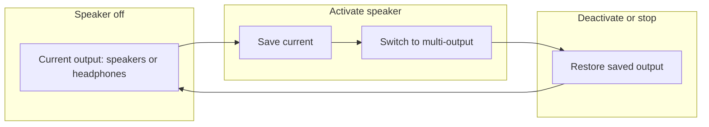

# Multi-channel device only while recording speakers

## Desired flow

- **Before speaker is on:** System output stays as-is (Mac speakers or headphones). No device switch.
- **Activate speaker** (at start or mid-recording): save current output → switch to multi-output device.
- **Deactivate speaker** (toggle off or stop recording): switch back to the saved device.

## Current state

The behavior is already implemented in the right places; a couple of gaps remain.

**Already correct:**

- [recorder.py](src/liscribe/recorder.py): `RecordingSession` has `_original_output`; `enable_speaker_capture()` does `get_current_output_device()` → `set_output_device(speaker_device_name)` and registers `atexit`; `disable_speaker_capture()` and `_stop_and_save()` call `_restore_audio_output()`. CLI `start()` with speaker saves current, switches, and registers atexit.
- [app.py](src/liscribe/app.py) and [screens/recording.py](src/liscribe/screens/recording.py): When starting with speaker they set `_original_output` and switch; on stop they call `session._stop_and_save()` (which restores); on cancel they call `session._restore_audio_output()`.

**Gaps:**

1. **TUI start with speaker:** In both `app.py` and `screens/recording.py`, when `_start_recording()` switches output for speaker-on, **atexit is not registered**. If the app is killed (e.g. force quit), output stays on Multi-Output. The CLI path and mid-recording `enable_speaker_capture()` do register atexit.
2. **atexit stacking:** Each `enable_speaker_capture()` call registers another atexit handler. After restore, the handler is effectively a no-op (`_original_output` is None), but unregistering after restore keeps atexit clean and avoids multiple no-op runs.

## Implementation plan

### 1. Register atexit when TUI switches output at start

In both entry points that start recording with speaker and switch the device:

- **[app.py](src/liscribe/app.py)** in `_start_recording()`: immediately after the successful `set_output_device(self.session.speaker_device_name)` block (around line 158), add:
  - `import atexit` at top if not present (app.py already has other imports from recorder/setup).
  - `atexit.register(self.session._restore_audio_output)` so a force-quit still restores output.
- **[screens/recording.py](src/liscribe/screens/recording.py)** in `_start_recording()`: same change after the successful `set_output_device(...)` (around line 137): add `atexit` import and `atexit.register(self.session._restore_audio_output)`.

### 2. Unregister atexit inside `_restore_audio_output` (recorder)

In [recorder.py](src/liscribe/recorder.py), in `_restore_audio_output()`:

- After calling `set_output_device(self._original_output)` and clearing `self._original_output`, call `atexit.unregister(self._restore_audio_output)` so the handler is removed and we don’t run it again at process exit (and avoid stacking if speaker is toggled multiple times).

Handle the case where the method might be called when it was never registered (e.g. TUI start path that didn’t use `enable_speaker_capture`): `atexit.unregister` is safe to call for a callable that wasn’t registered (no-op in Python). So a single implementation in `_restore_audio_output` covers both CLI/TUI and mid-recording.

### 3. No change to “when” we switch

- Do **not** switch output when speaker is off (already correct).
- Keep switching only when:
  - Starting recording with speaker on (app/screen/recorder.start), or
  - Enabling speaker mid-recording (`enable_speaker_capture`).
- Keep restoring only when:
  - Disabling speaker mid-recording (`disable_speaker_capture`), or
  - Stopping/cancelling recording (`_stop_and_save` or explicit `_restore_audio_output` in cancel paths).

### Summary diagram

Files to touch:

- [src/liscribe/recorder.py](src/liscribe/recorder.py): add `atexit.unregister(self._restore_audio_output)` at end of `_restore_audio_output()` after restoring.
- [src/liscribe/app.py](src/liscribe/app.py): add `atexit` import and `atexit.register(self.session._restore_audio_output)` after successful speaker device switch in `_start_recording()`.
- [src/liscribe/screens/recording.py](src/liscribe/screens/recording.py): add `atexit` import and `atexit.register(self.session._restore_audio_output)` after successful speaker device switch in `_start_recording()`.

No config or CLI changes required. Optional: add a one-line comment above the “Speaker setup” block in app/screen noting that output is switched only while speaker capture is active and is restored on deactivate or stop.
