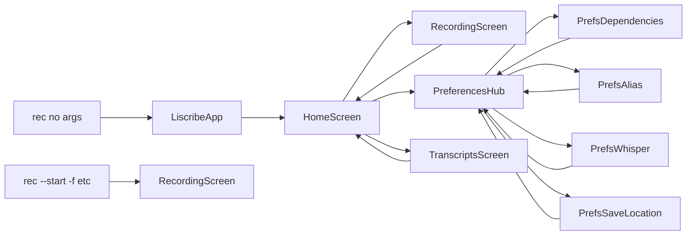

# Settings TUI and CLI Restructure

## Current state

- **CLI:** `rec` with no subcommand goes straight to the recording TUI (`[cli.py](src/liscribe/cli.py)` `main()` → `RecordingApp`). `rec setup` runs dependency checks and interactive config (alias, language, models) via Click prompts.
- **App:** Single `[RecordingApp](src/liscribe/app.py)` composes the recording UI; modals (`MicSelectScreen`, `ConfirmCancelScreen`) live in the same file. Styles in `[rec.css](src/liscribe/rec.css)` use `$accent`, `$primary`, `$surface`, etc.
- **Config:** `[config.py](src/liscribe/config.py)` holds `save_folder`, `command_alias`, `whisper_model`, `language`, etc. Alias writing to shell rc is in `[cli.py](src/liscribe/cli.py)` (`_update_shell_alias`, `_get_shell_rc_path`).
- **Dependencies:** `[platform_setup.py](src/liscribe/platform_setup.py)` exposes `run_all_checks()` (PortAudio, BlackHole, switchaudio-osx, Multi-Output Device); no install-from-app today.
- **Whisper:** `[transcriber.py](src/liscribe/transcriber.py)` has `WHISPER_MODELS`-like info in CLI (`WHISPER_MODELS` in cli.py), `is_model_available()`, `load_model()` (downloads on first use), and config for `whisper_model` / `language`.

## Target behavior


| Invocation                                                                       | Behavior                                                                                                                                                        |
| -------------------------------------------------------------------------------- | --------------------------------------------------------------------------------------------------------------------------------------------------------------- |
| `rec` (no options, no subcommand)                                                | Launch TUI with **Home screen** (Record, Preferences, Transcripts, ^Q Quit).                                                                                    |
| `rec --start -f /path` (or `rec --start -f /path -s` for speaker, `--mic`, etc.) | Go **straight to the Record TUI** with that folder/options — i.e. what `rec` does today. Quick way from terminal to start recording without opening Home first. |
| From Home: **Record**                                                            | Push the recording screen; folder/speaker/mic from config.                                                                                                      |
| From Home: **Preferences**                                                       | Open Preferences (hub then sub-pages: Dependencies, Alias, Whisper, Save location).                                                                             |
| From Home: **Transcripts**                                                       | Open transcript list (save_folder; copy to clipboard per item).                                                                                                 |


Setup and first-time config are handled by **./install.sh** only. No CLI “init” or “setup flow” in this plan.

---

## 1. CLI changes

**File:** `[src/liscribe/cli.py](src/liscribe/cli.py)`

- `**rec`** (no subcommand, no `--start`) → Launch TUI and show **Home**.
- `**rec --start`** (with optional `-f`/`--folder`, `-h`/`--here`, `-s`/`--speaker`, `--mic`) → Launch TUI and go **straight to the Record screen** with those options (same behavior as current `rec` today). This is the quick terminal shortcut to start recording.
- Subcommands like `rec preferences`, `rec help`, `rec devices` (and any others from the full TUI plan) launch the TUI and land on the corresponding screen. No “setup flow” or “init” in the CLI — setup is **./install.sh** only.

---

## 2. App as controller and screen split

**Controller app (e.g. keep name `RecordingApp` or rename to `LiscribeApp`)** in `[src/liscribe/app.py](src/liscribe/app.py)`:

- Single entry point: composes no default content (or a minimal frame), and **on_mount** pushes **Home** by default, or **Recording** when the CLI was invoked with `--start` (and pass through -f/-s/--mic etc.).
- Uses **one CSS file:** `rec.css`.
- BINDINGS at app level (e.g. ^Q Quit on Home; recording-specific bindings when Recording screen is active).
- Responsibilities: push/pop screens, pass folder/speaker/mic/config into Recording screen, and own the screen stack.

**Screens in separate modules** under a new package so they are easier to manage:

- `src/liscribe/screens/__init__.py` — export screen classes.
- `src/liscribe/screens/home.py` — **Home screen:** title “liscribe”, subtitle “Listen & transcribe locally”, buttons: **^r Record**, **^p Preferences**, **^t Transcripts**, and **^Q Quit** (fix wireframe typo “Quite” → “Quit”). Same visual style as wireframe: orange border, yellow primary buttons, white/surface background. All styles from `rec.css` (reuse existing IDs/classes or add `.home-frame`, `.home-btn` etc. in rec.css).
- `src/liscribe/screens/recording.py` — **Recording screen:** current recording UI (waveform, mic bar, notes, footer) and logic moved out of `RecordingApp` into a single Screen class (e.g. `RecordingScreen`). Compose and all recording behavior (start/stop, mic switch, speaker toggle, notes, save/cancel) live here; app only pushes this screen with folder, speaker, mic, prog_name and handles return value (saved path or None).
- `src/liscribe/screens/transcripts.py` — **Transcripts screen:** heading “Transcripts”, list of transcript items (from `save_folder`: e.g. list `.md` files by mtime, display date and “copy to clipboard”). Scrollable list; each row can trigger copy (reuse clipboard logic from `[output.py](src/liscribe/output.py)` `copy_to_clipboard`). Back action to return to Home.
- `src/liscribe/screens/preferences/` or flat `prefs_*.py`:
  - **Preferences hub** (e.g. `screens/preferences.py` or `screens/prefs_hub.py`): one screen with four entries: **Dependency check**, **Alias**, **Whisper**, **Save location**. Each opens a sub-screen. Back to Home.
  - **Dependency check** (`screens/prefs_dependencies.py`): run `run_all_checks(include_speaker=True)`; show list: name, status (OK / Missing), short message. For missing items, show an **Install** button that runs the appropriate `brew install` (or `brew install --cask`) in a worker and shows progress/toast. Map check name → brew package (e.g. PortAudio → `portaudio`, BlackHole → `blackhole-2ch`, switchaudio → `switchaudio-osx`). Add a small helper in `[platform_setup.py](src/liscribe/platform_setup.py)` if needed, e.g. `get_install_command(name)` and optionally `run_install(name)` using `subprocess`/`@work`.
  - **Alias** (`screens/prefs_alias.py`): input for command alias (default from config `command_alias`). “Update” or “Save” button: write config with `save_config()` and call `_update_shell_alias(alias)` (move or import from cli); notify “Updated ~/.zshrc” or similar.
  - **Whisper** (`screens/prefs_whisper.py`): (1) **Language:** input or select (default from config `language`). (2) **Default model:** list of models (reuse `WHISPER_MODELS` from cli or centralize in config/transcriber) with current default marked; select to set and save. (3) **Download models:** list each model with installed ✓/✗ and [Download] / [Remove]. Download runs `load_model(name)` in a worker (already downloads on first use); Remove deletes that model’s cache dir under `get_model_path()` (optional for later). Save on change.
  - **Save location** (`screens/prefs_save_location.py`): one setting “Default save folder” (config `save_folder`). Input with current value; “Save” writes config. Optionally show short note that “--here” saves to ./docs/transcripts for the current run (no stored path).

All new screens use the same **rec.css** (add any new IDs/classes for home, prefs, transcripts list) so the look matches the existing recording UI (orange borders, primary/accent colors, same typography).

---

## 3. Data and logic reuse

- **Config:** All preference screens read/write via `[config.py](src/liscribe/config.py)` `load_config()` / `save_config()`. No duplicate defaults.
- **Alias:** Use existing `_update_shell_alias` and `_get_shell_rc_path`; either move them to a small shared module (e.g. `liscribe.shell_alias`) or import from cli (avoid circular imports: cli imports app → app/screens should not import cli; so move alias helpers to a module both can use).
- **Whisper:** Use `[transcriber.py](src/liscribe/transcriber.py)` `is_model_available`, `load_model`, `get_model_path()`; model list can live in transcriber or a shared constant used by cli and prefs_whisper.
- **Transcript list:** Scan `Path(cfg["save_folder"]).expanduser().resolve()` for `*.md` (or whatever matches saved transcripts); sort by mtime; show date (e.g. DD-MM-YYYY from mtime or filename) and “copy to clipboard” (read file content and call existing clipboard helper).

---

## 4. Flow summary




---

## 5. UI mockups (new screens)

Style: orange border (`$accent`), yellow primary buttons (`$primary`), white/surface background; same as existing recording UI and wireframes. All use `rec.css`.

### 5.1 Home

```
┌─ HOME ─────────────────────────────────────────────────────────────┐
│  ┌───────────────────────────────────────────────────────────────┐   │
│  │                     liscribe                                  │   │
│  │              Listen & transcribe locally                       │   │
│  │                                                                │   │
│  │  ┌─────────────────────┐                                      │   │
│  │  │ ^r  Record           │   (yellow / primary)                  │   │
│  │  └─────────────────────┘                                      │   │
│  │  ┌─────────────────────┐                                      │   │
│  │  │ ^p  Preferences      │                                      │   │
│  │  └─────────────────────┘                                      │   │
│  │  ┌─────────────────────┐                                      │   │
│  │  │ ^t  Transcripts      │                                      │   │
│  │  └─────────────────────┘                                      │   │
│  │                                                                │   │
│  │                                    ^Q  Quit                    │   │
│  └───────────────────────────────────────────────────────────────┘   │
└─────────────────────────────────────────────────────────────────────┘
```

### 5.2 Record

Existing recording UI: top bar (status, Speaker, Mic), mic bar, waveform(s), notes area (scroll + input), footer (^s Stop & Save, ^C Cancel). No layout change — just moved into `RecordingScreen`. Orange frame, accent top bar, primary “Stop & Save” button.

### 5.3 Transcribing (after Record ends)

```
┌─ TRANSCRIBING ─────────────────────────────────────────────────────┐
│  ┌───────────────────────────────────────────────────────────────┐ │
│  │  liscribe                                                     │ │
│  │  ─────────────────────────────────────────────────────────────│ │
│  │  Transcribing…                                                │ │
│  │  Model: base                                                  │ │
│  │  ████████████████░░░░░░░░   ~45%  (or segment-based progress)  │ │
│  │                                                                │ │
│  │  [Done / Open folder]  (when complete; then auto or button     │ │
│  │                         back to Home)                         │ │
│  └───────────────────────────────────────────────────────────────┘ │
└─────────────────────────────────────────────────────────────────────┘
```

### 5.4 Preferences hub

```
┌─ PREFERENCES ─────────────────────────────────────────────────────┐
│  ┌───────────────────────────────────────────────────────────────┐ │
│  │  liscribe                                                      │ │
│  │  ─────────────────────────────────────────────────────────────│ │
│  │  Preferences                                                   │ │
│  │                                                                │ │
│  │  ┌─────────────────────────────┐                             │ │
│  │  │  Dependency check            │  [Open]                      │ │
│  │  └─────────────────────────────┘                             │ │
│  │  ┌─────────────────────────────┐                             │ │
│  │  │  Alias                       │  [Open]                      │ │
│  │  └─────────────────────────────┘                             │ │
│  │  ┌─────────────────────────────┐                             │ │
│  │  │  Whisper                     │  [Open]                      │ │
│  │  └─────────────────────────────┘                             │ │
│  │  ┌─────────────────────────────┐                             │ │
│  │  │  Save location              │  [Open]                      │ │
│  │  └─────────────────────────────┘                             │ │
│  │                                                                │ │
│  │  [Back to Home]                                                │ │
│  └───────────────────────────────────────────────────────────────┘ │
└─────────────────────────────────────────────────────────────────────┘
```

### 5.5 Preferences — Dependency check

```
┌─ DEPENDENCY CHECK ─────────────────────────────────────────────────┐
│  ┌───────────────────────────────────────────────────────────────┐ │
│  │  Dependency check                                             │ │
│  │  ─────────────────────────────────────────────────────────────│ │
│  │  PortAudio         OK    PortAudio is available.              │ │
│  │  BlackHole          OK    BlackHole found: BlackHole 2ch       │ │
│  │  switchaudio-osx    MISSING   Install with: brew install …     │ │
│  │                                    [Install]                  │ │
│  │  Multi-Output Dev.  OK    Multi-Output Device found.            │ │
│  │                                                                │ │
│  │  [Back to Preferences]                                         │ │
│  └───────────────────────────────────────────────────────────────┘ │
└─────────────────────────────────────────────────────────────────────┘
```

### 5.6 Preferences — Alias

```
┌─ ALIAS ───────────────────────────────────────────────────────────┐
│  ┌───────────────────────────────────────────────────────────────┐ │
│  │  Alias                                                        │ │
│  │  ─────────────────────────────────────────────────────────────│ │
│  │  Command alias (used in help and shell):                      │ │
│  │  ┌─────────────────────────────────────────────────────────┐  │ │
│  │  │ rec                                                      │  │ │
│  │  └─────────────────────────────────────────────────────────┘  │ │
│  │  Updates ~/.zshrc when you save.                              │ │
│  │                                                                │ │
│  │  [Save and update zshrc]   [Back to Preferences]              │ │
│  └───────────────────────────────────────────────────────────────┘ │
└─────────────────────────────────────────────────────────────────────┘
```

### 5.7 Preferences — Whisper

```
┌─ WHISPER ─────────────────────────────────────────────────────────┐
│  ┌───────────────────────────────────────────────────────────────┐ │
│  │  Whisper                                                       │ │
│  │  ─────────────────────────────────────────────────────────────│ │
│  │  Language:  ┌────────┐   (e.g. en, auto)                       │ │
│  │             │ en     │                                         │ │
│  │             └────────┘                                         │ │
│  │  Default model:  base  ◄  (list: tiny, base, small, medium,   │ │
│  │                            large; current default marked)      │ │
│  │  Download models:                                              │ │
│  │    tiny    ✓ installed                                         │ │
│  │    base    ✓ installed  (default)   [Remove]                    │ │
│  │    small   not installed            [Download]                  │ │
│  │    medium  not installed            [Download]                  │ │
│  │    large   not installed            [Download]                  │ │
│  │                                                                │ │
│  │  [Back to Preferences]                                         │ │
│  └───────────────────────────────────────────────────────────────┘ │
└─────────────────────────────────────────────────────────────────────┘
```

### 5.8 Preferences — Save location

```
┌─ SAVE LOCATION ───────────────────────────────────────────────────┐
│  ┌───────────────────────────────────────────────────────────────┐ │
│  │  Save location                                                 │ │
│  │  ─────────────────────────────────────────────────────────────│ │
│  │  Default save folder (recordings and transcripts):             │ │
│  │  ┌─────────────────────────────────────────────────────────┐  │ │
│  │  │ ~/transcripts                                            │  │ │
│  │  └─────────────────────────────────────────────────────────┘  │ │
│  │  Use --here when starting a recording to save to               │ │
│  │  ./docs/transcripts in the current directory.                   │ │
│  │                                                                │ │
│  │  [Save]   [Back to Preferences]                                 │ │
│  └───────────────────────────────────────────────────────────────┘ │
└─────────────────────────────────────────────────────────────────────┘
```

### 5.9 Transcripts

```
┌─ TRANSCRIPTS ─────────────────────────────────────────────────────┐
│  ┌───────────────────────────────────────────────────────────────┐ │
│  │  liscribe                                                      │ │
│  │  ─────────────────────────────────────────────────────────────│ │
│  │  Transcripts                                                   │ │
│  │                                                                │ │
│  │  ┌─────────────────────────────────────────────────────────┐  │ │
│  │  │ 19-02-2025   recording_base.md      [copy to clipboard]   │  │ │
│  │  │ 18-02-2025   meeting_small.md      [copy to clipboard]   │  │ │
│  │  │ 17-02-2025   notes_tiny.md         [copy to clipboard]   │  │ │
│  │  │     … (scrollable)                                        │  │ │
│  │  └─────────────────────────────────────────────────────────┘  │ │
│  │                                                                │ │
│  │  [Back to Home]                                                │ │
│  └───────────────────────────────────────────────────────────────┘ │
└─────────────────────────────────────────────────────────────────────┘
```

### 5.10 Help

```
┌─ HELP ────────────────────────────────────────────────────────────┐
│  ┌───────────────────────────────────────────────────────────────┐ │
│  │  Help                                                          │ │
│  │  ─────────────────────────────────────────────────────────────│ │
│  │  Liscribe — 100% offline terminal recorder and transcriber.    │ │
│  │                                                                │ │
│  │  Usage:  rec [OPTIONS] [COMMAND]                               │ │
│  │          rec --start -f /path   Start recording (skip Home)    │ │
│  │          rec preferences        Open Preferences TUI           │ │
│  │          rec help               Open this help                │ │
│  │          rec devices            List devices TUI              │ │
│  │  Options:  -f, --folder  -h, --here  -s, --speaker  --mic …    │ │
│  │  (scrollable; same content as rec --help)                      │ │
│  │                                                                │ │
│  │  [Back to Home]                                                │ │
│  └───────────────────────────────────────────────────────────────┘ │
└─────────────────────────────────────────────────────────────────────┘
```

### 5.11 Devices

```
┌─ DEVICES ─────────────────────────────────────────────────────────┐
│  ┌───────────────────────────────────────────────────────────────┐ │
│  │  Input devices                                                 │ │
│  │  ─────────────────────────────────────────────────────────────│ │
│  │  ┌─────────────────────────────────────────────────────────┐  │ │
│  │  │ [0] MacBook Pro Microphone  (1ch, 48000Hz)  (default)    │  │ │
│  │  │ [1] BlackHole 2ch            (2ch, 48000Hz)              │  │ │
│  │  │ [2] External USB Mic         (1ch, 44100Hz)               │  │ │
│  │  │     … (scrollable)                                        │  │ │
│  │  └─────────────────────────────────────────────────────────┘  │ │
│  │                                                                │ │
│  │  [Back to Home]                                                │ │
│  └───────────────────────────────────────────────────────────────┘ │
└─────────────────────────────────────────────────────────────────────┘
```

---

## 6. File layout (summary)


| Path                                                    | Purpose                                                                                        |
| ------------------------------------------------------- | ---------------------------------------------------------------------------------------------- |
| `src/liscribe/app.py`                                   | Controller app: entry TUI, push Home (or Recording when `rec --start`), use rec.css, bindings. |
| `src/liscribe/screens/__init__.py`                      | Export screen classes.                                                                         |
| `src/liscribe/screens/home.py`                          | Home screen (Record, Preferences, Transcripts, Quit).                                          |
| `src/liscribe/screens/recording.py`                     | Recording UI and logic (moved from current app).                                               |
| `src/liscribe/screens/transcripts.py`                   | List transcripts, copy to clipboard.                                                           |
| `src/liscribe/screens/preferences.py` or `prefs_hub.py` | Preferences menu (4 entries).                                                                  |
| `src/liscribe/screens/prefs_dependencies.py`            | Dependency check + Install.                                                                    |
| `src/liscribe/screens/prefs_alias.py`                   | Alias input + update zshrc.                                                                    |
| `src/liscribe/screens/prefs_whisper.py`                 | Language, default model, download/remove models.                                               |
| `src/liscribe/screens/prefs_save_location.py`           | Default save folder path.                                                                      |
| `src/liscribe/rec.css`                                  | All styles (add for home, prefs, transcripts).                                                 |
| `src/liscribe/platform_setup.py`                        | Optional: `get_install_command()` / `run_install()` for dependency install from TUI.           |


Optional: move `_get_shell_rc_path` and `_update_shell_alias` to e.g. `src/liscribe/shell_alias.py` so both cli and prefs_alias can use them without cli ↔ app circular imports.

---

## 7. Out of scope / follow-ups

- **Transcripts screen:** “Remove” or “Delete” for a transcript (and associated audio) can be a later iteration.
- **Remove model:** Deleting a model from cache in prefs_whisper can be added after the basic Download flow works.

---

## 8. Implementation order (suggested)

1. **CLI:** When no subcommand, launch TUI. Add `--start`; when `--start` is set (with optional `-f`, `-s`, `--mic` etc.), pass a “land on Record” flag and options into the app so it pushes Recording screen first instead of Home.
2. **Screens package + Home:** Create `screens/`, implement Home screen with buttons and navigation stubs (Record → push Recording placeholder; Preferences → push Preferences hub placeholder; Transcripts → push Transcripts placeholder; Quit → exit). Add rec.css for Home.
3. **Recording screen:** Extract current recording UI and logic from `RecordingApp` into `RecordingScreen`; app pushes it from Home “Record” or when started with `rec --start`. Handle return (saved path / None) and post-record transcription (Transcribing screen then back to Home).
4. **Preferences hub + Dependencies:** Hub with 4 items; Dependencies screen with `run_all_checks()` and Install (plus platform_setup helper if needed).
5. **Preferences: Alias, Whisper, Save location:** Implement the three remaining pref screens and wire to config/alias/transcriber.
6. **Transcripts screen:** List from save_folder, copy to clipboard, back to Home.
7. **rec --start:** Ensure `rec --start -f /path` etc. opens TUI and goes straight to Record with that folder/options.

