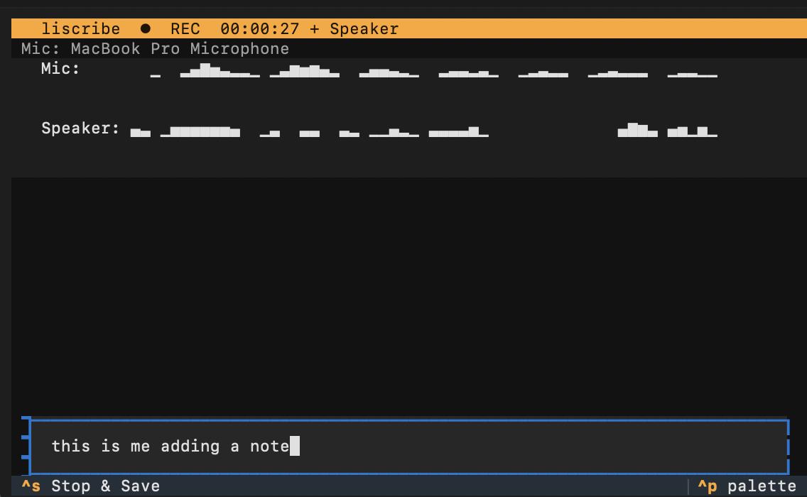

# Liscribe

100% offline terminal audio recorder and transcriber for macOS.


Record from your microphone (and optionally system audio via BlackHole), transcribe locally with faster-whisper, and save Markdown transcripts — all without any network access.

## Install

Requires macOS, Python 3.10+, and [Homebrew](https://brew.sh).

```bash
git clone <repo-url> liscribe
cd liscribe
./install.sh
```

The installer will:

1. Check and install Homebrew dependencies (PortAudio, optionally BlackHole)
2. Create a Python virtual environment and install the package
3. Let you choose a whisper model and transcription language
4. Set up a shell alias (default: `rec`)

Open a new terminal after install, then you're ready to go.

## Uninstall

```bash
cd liscribe
./uninstall.sh
```

This removes the virtual environment, config, model cache, and shell alias. Optionally removes Homebrew dependencies (portaudio, blackhole-2ch, switchaudio-osx).

## Usage

```bash
rec -f /path/to/save              # Record mic, save to folder
rec -f /path/to/save -s           # Record mic + speaker (BlackHole), source-labeled merge
rec -f /path/to/save --mic "USB" # Use a specific microphone
rec -h                            # Save to ./docs/transcripts in current directory
rec transcribe file.wav           # Transcribe existing audio (or rec t file.wav)
rec devices                       # List available input devices
rec setup                         # Re-configure model, language, check deps
rec config --show                 # Show current config
rec --help                        # Full command and option list
```

During recording you can type notes; they are timestamped and included in the transcript as footnote references [1], [2] and a Notes section.

With `-s`, Liscribe records two source tracks (`mic.wav`, `speaker.wav`) and writes a merged chronological transcript where speaker labels are deterministic:

```text
[00:03.2] YOU: ...
[00:05.7] THEM: ...
```

## Models and transcription

- **Default model** comes from config (`whisper_model`). Override per run with `--tiny`, `--base`, `--small`, `--medium`, `--large` (short: `-xxs`, `-xs`, `-sm`, `-md`, `-lg`).
- **Multi-model:** pass multiple flags (e.g. `rec -f ~/out -sm -md` or `rec t file.wav -sm -md`) to get one transcript per model; filenames get a model suffix when using more than one; clipboard gets the highest-quality result. Run `rec setup` to install more models.

## Configuration

Config lives at `~/.config/liscribe/config.json`. See `config.example.json` for all options with descriptions.

Key settings:

| Setting | Default | Description |
|---------|---------|-------------|
| `whisper_model` | `base` | Model size: `tiny`, `base`, `small`, `medium`, `large` |
| `language` | `en` | ISO 639-1 code (`en`, `fr`, `de`, ...) or `auto` for auto-detect |
| `save_folder` | `~/transcripts` | Default output folder (override with `-f`) |

## System Requirements

- **macOS**
- **Python 3.10+**
- **Homebrew**
- **PortAudio** — installed automatically by `install.sh`
- **BlackHole + switchaudio-osx** (optional, for `-s` speaker capture) — offered during install

### BlackHole Setup (for speaker capture)

After installing BlackHole (offered during `./install.sh`):

1. Open **Audio MIDI Setup** (Spotlight → "Audio MIDI Setup")
2. Click **+** → **Create Multi-Output Device**
3. Check your speakers/headphones **and** BlackHole 2ch
4. Now `rec -f path -s` will switch output to this device during recording

## Architecture

See [docs/architecture.md](docs/architecture.md) for C4 diagrams.
