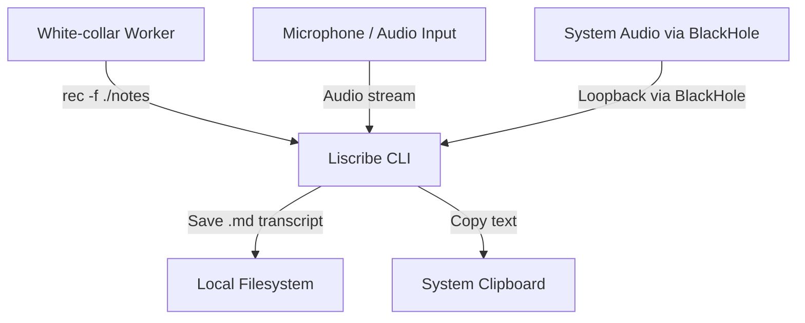
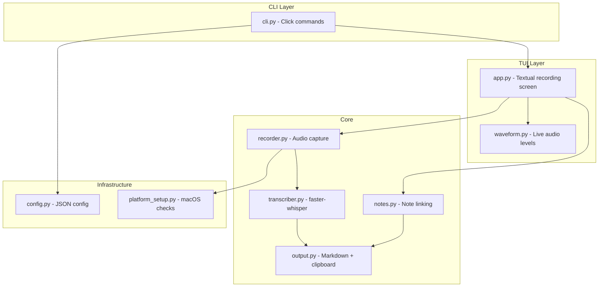
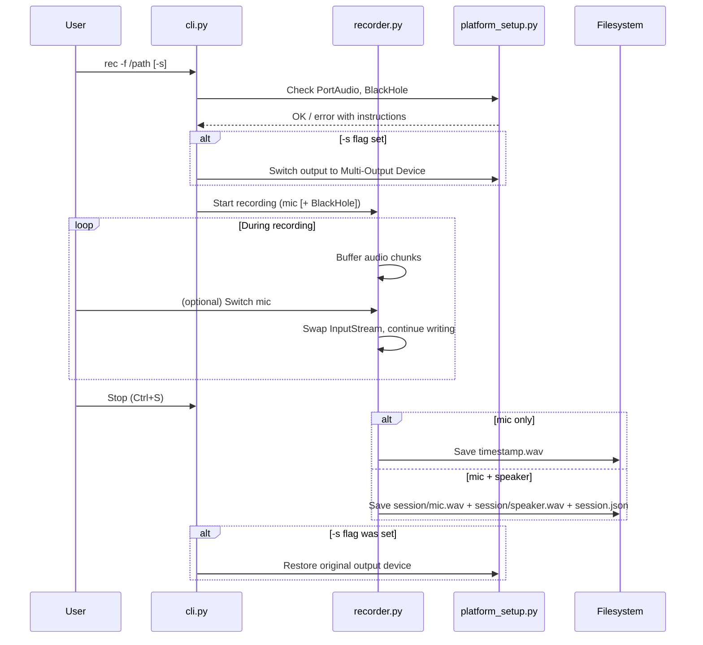
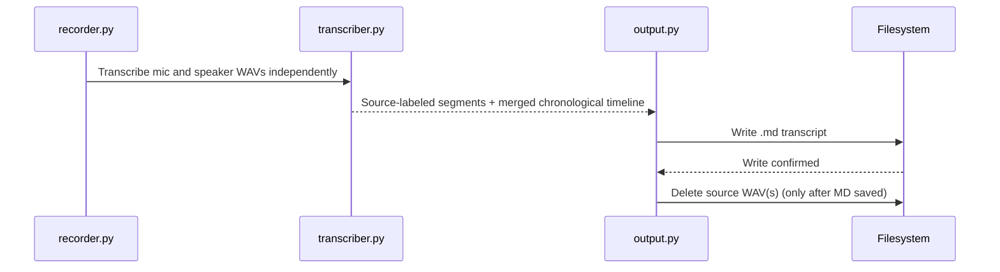

# Liscribe Architecture

## C4 Context Diagram

```mermaid
graph TD
    User["White-collar Worker"]
    Liscribe["Liscribe CLI"]
    Mic["Microphone / Audio Input"]
    Speaker["System Audio via BlackHole"]
    FS["Local Filesystem"]
    Clip["System Clipboard"]

    User -->|"rec -f ./notes"| Liscribe
    Mic -->|"Audio stream"| Liscribe
    Speaker -->|"Loopback via BlackHole"| Liscribe
    Liscribe -->|"Save .md transcript"| FS
    Liscribe -->|"Copy text"| Clip
```

## C4 Container Diagram

```mermaid
graph TD
    subgraph cli_layer [CLI Layer]
        CLI["cli.py - Click commands"]
    end

    subgraph core [Core]
        Recorder["recorder.py - Audio capture"]
        Transcriber["transcriber.py - faster-whisper"]
        Notes["notes.py - Note linking"]
        Output["output.py - Markdown + clipboard"]
    end

    subgraph ui [TUI Layer]
        App["app.py - Textual recording screen"]
        Waveform["waveform.py - Live audio levels"]
    end

    subgraph infra [Infrastructure]
        Config["config.py - JSON config"]
        Platform["platform_setup.py - macOS checks"]
    end

    CLI --> App
    CLI --> Config
    App --> Recorder
    App --> Waveform
    App --> Notes
    Recorder --> Transcriber
    Transcriber --> Output
    Notes --> Output
    Recorder --> Platform
```

## Recording Flow

```mermaid
sequenceDiagram
    participant User
    participant CLI as cli.py
    participant Rec as recorder.py
    participant Platform as platform_setup.py
    participant FS as Filesystem

    User->>CLI: rec -f /path [-s]
    CLI->>Platform: Check PortAudio, BlackHole
    Platform-->>CLI: OK / error with instructions

    alt -s flag set
        CLI->>Platform: Switch output to Multi-Output Device
    end

    CLI->>Rec: Start recording (mic [+ BlackHole])
    loop During recording
        Rec->>Rec: Buffer audio chunks
        User->>Rec: (optional) Switch mic
        Rec->>Rec: Swap InputStream, continue writing
    end
    User->>CLI: Stop (Ctrl+S)
    alt mic only
        Rec->>FS: Save timestamp.wav
    else mic + speaker
        Rec->>FS: Save session/mic.wav + session/speaker.wav + session.json
    end

    alt -s flag was set
        CLI->>Platform: Restore original output device
    end
```

## Transcription and Cleanup Flow

```mermaid
sequenceDiagram
    participant Rec as recorder.py
    participant Trans as transcriber.py
    participant Out as output.py
    participant FS as Filesystem

    Rec->>Trans: Transcribe mic and speaker WAVs independently
    Trans-->>Out: Source-labeled segments + merged chronological timeline
    Out->>FS: Write .md transcript
    FS-->>Out: Write confirmed
    Out->>FS: Delete source WAV(s) (only after MD saved)
```
